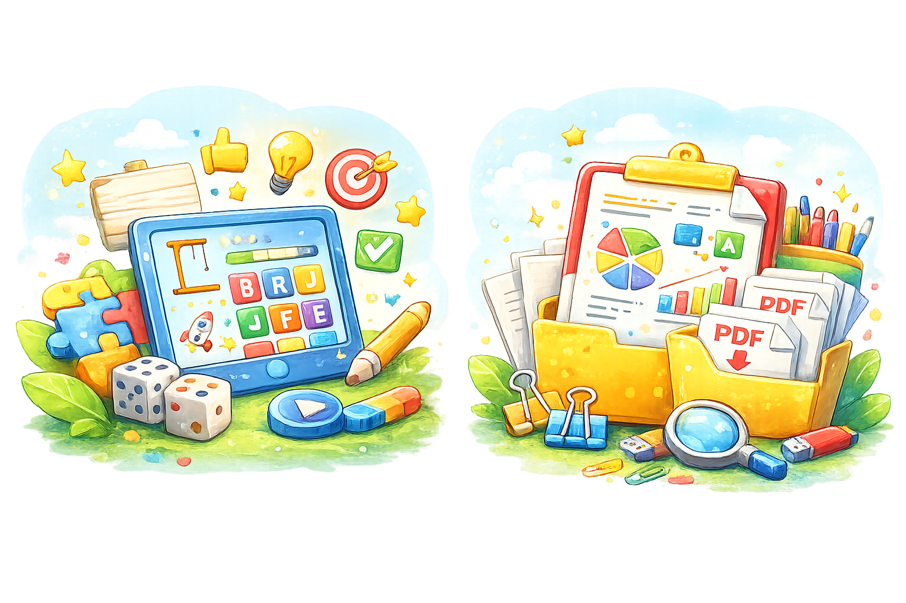

  

# El Rincón de Segundo 2°
Actividades didácticas de **Lenguaje** para niños de **grado segundo** de primaria.

---

## LENGUAJE

### Actividades en Wordwall

  

> **Curaduría del repositorio:** libeltran161-creator  
> **Créditos:** cada actividad conserva el autor original en Wordwall.

---

#### 🧩 Sílabas trabadas — [Abrir actividad](https://wordwall.net/es/resource/12341206)
- **Título:** Sílabas trabadas  
- **Autor original (Wordwall):** Lauragutierrezs  
- **Curaduría / repositorio:** libeltran161-creator  
- **Descripción:** Actividad gamificada para fortalecer la lectura y escritura de sílabas trabadas (bl, br, cl, cr, dr, fl, fr, gl, gr, pl, pr, tl, tr). Favorece la decodificación y la ortografía natural con práctica y retroalimentación inmediata.  
- **Área temática:** Lenguaje – Lectoescritura / Conciencia fonológica  
- **Nivel educativo:** Básica primaria – Grado 2  
- **Competencia:** Decodificación y fluidez lectora; escritura correcta  
- **Tipo de recurso:** Actividad gamificada  
- **Formato:** Wordwall  
- **Enlace:** https://wordwall.net/es/resource/12341206  
- **Fecha de creación:** (según Wordwall: no indicada)  
- **Licencia:** Uso educativo (enlace a recurso externo)

---

#### 🧩 El cuento — [Abrir actividad](https://wordwall.net/es/resource/14483473)
- **Título:** El cuento  
- **Autor original (Wordwall):** Valeriamorisc  
- **Curaduría / repositorio:** libeltran161-creator  
- **Descripción:** Actividad gamificada para reconocer elementos del cuento (personajes, lugar, inicio, nudo y desenlace) y fortalecer la comprensión lectora mediante selección y clasificación de información.  
- **Área temática:** Lenguaje – Literatura infantil / Comprensión lectora  
- **Nivel educativo:** Básica primaria – Grado 2  
- **Competencia:** Comprensión lectora; identificación de estructura narrativa  
- **Tipo de recurso:** Actividad gamificada  
- **Formato:** Wordwall  
- **Enlace:** https://wordwall.net/es/resource/14483473  
- **Fecha de creación:** (según Wordwall: no indicada)  
- **Licencia:** Uso educativo (enlace a recurso externo)

---

#### 🧩 La fábula — [Abrir actividad](https://wordwall.net/es/resource/33629610)
- **Título:** La fábula  
- **Autor original (Wordwall):** Cristinarifo1  
- **Curaduría / repositorio:** libeltran161-creator  
- **Descripción:** Actividad gamificada para identificar características de la fábula (texto breve, personajes y moraleja). Promueve la interpretación de mensajes y la reflexión sobre valores a partir de la enseñanza final.  
- **Área temática:** Lenguaje – Géneros literarios / Comprensión lectora  
- **Nivel educativo:** Básica primaria – Grado 2  
- **Competencia:** Interpretación textual; identificación de moraleja y propósito  
- **Tipo de recurso:** Actividad gamificada  
- **Formato:** Wordwall  
- **Enlace:** https://wordwall.net/es/resource/33629610  
- **Fecha de creación:** (según Wordwall: no indicada)  
- **Licencia:** Uso educativo (enlace a recurso externo)

---

### PDFs y materiales descargables

  

> **Créditos:** cada documento conserva su autor/fuente original cuando es identificable.

---

#### 📄 Actividades para trabajar sílabas trabadas (PDF) — [Ver/Descargar](./Actividades-para-trabajar-silabas-trabadas.pdf)
- **Título:** Actividades para trabajar sílabas trabadas  
- **Autor original:** Docentes al día 2024 (Docentesaldia.com)  
- **Curaduría / repositorio:** libeltran161-creator  
- **Descripción:** Guía de práctica con ejercicios para reforzar sílabas trabadas mediante lectura, escritura y actividades aplicadas.  
- **Área temática:** Lenguaje – Lectoescritura  
- **Nivel educativo:** Básica primaria – Grado 2  
- **Competencia:** Lectura y escritura; ortografía natural  
- **Tipo de recurso:** Guía / Taller descargable  
- **Formato:** PDF  
- **Enlace:** ./Actividades-para-trabajar-silabas-trabadas.pdf  
- **Fecha de creación:** 2024  
- **Licencia:** Uso educativo (material de tercero)

---

#### 📄 Las oraciones y sus tipos (PDF) — [Ver/Descargar](./Las%20oraciones%20y%20sus%20tipos.pdf)
- **Título:** Las oraciones y sus tipos  
- **Autor original:** No identificado en el archivo (no aparece autor explícito)  
- **Fuente probable:** Material tipo “Grado 5 Lenguaje” (2015)  
- **Curaduría / repositorio:** libeltran161-creator  
- **Descripción:** Material para reconocer estructura de la oración y tipos de oraciones, con ejercicios y tarea.  
- **Área temática:** Lenguaje – Gramática  
- **Nivel educativo:** Básica primaria (ajustable a refuerzo)  
- **Competencia:** Reconocimiento de la oración; análisis gramatical básico  
- **Tipo de recurso:** Guía / Taller descargable  
- **Formato:** PDF  
- **Enlace:** ./Las%20oraciones%20y%20sus%20tipos.pdf  
- **Fecha de creación:** 2015 (según metadatos del archivo)  
- **Licencia:** Uso educativo (material de tercero)

---

#### 📝 Sílabas trabadas (DOCX) — [Descargar](./Silabas%20trabadas.docx)
- **Título:** Sílabas trabadas  
- **Autor original:** Liliana Beltrán Martínez  
- **Curaduría / repositorio:** libeltran161-creator  
- **Descripción:** Documento editable para actividades de sílabas trabadas (ideal para imprimir o adaptar).  
- **Área temática:** Lenguaje – Lectoescritura  
- **Nivel educativo:** Básica primaria – Grado 2  
- **Competencia:** Lectura y escritura; fluidez y ortografía  
- **Tipo de recurso:** Documento editable / Taller  
- **Formato:** DOCX  
- **Enlace:** ./Silabas%20trabadas.docx  
- **Fecha de creación:** 2026  
- **Licencia:** Uso educativo – CC BY-NC (repositorio)

---

